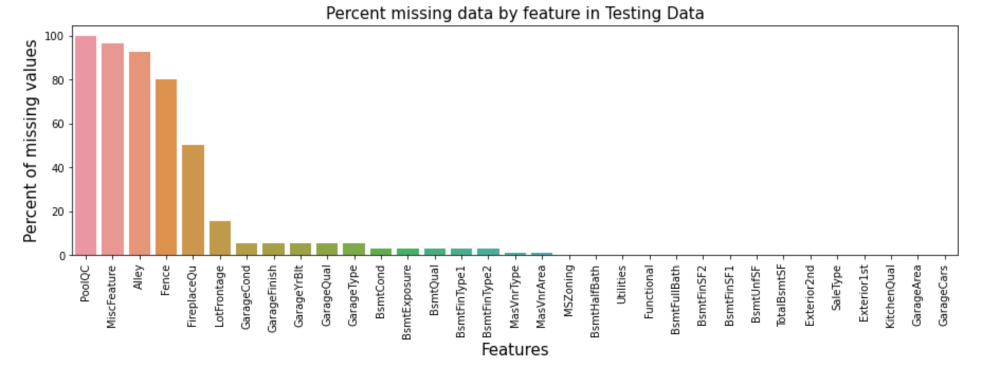
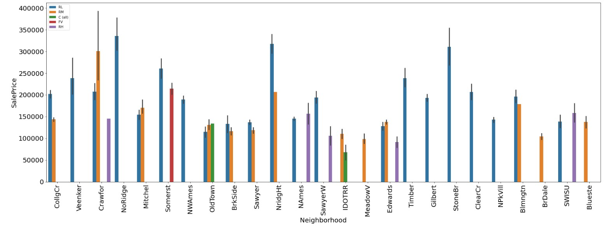
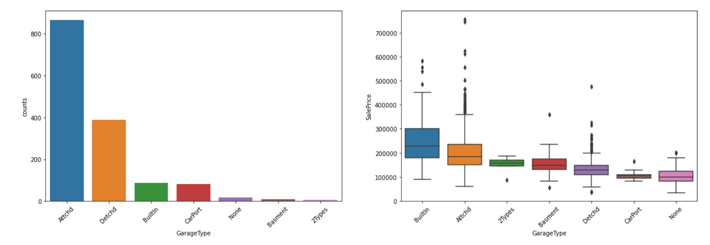

# House Pricing Prediction Portfolio

  

  

The jupyter notebook in this repo is procedural, it contains explanation of all the steps and respective findings with the use of markdowns. This readme will give a summary of the steps and results of the project. 

Project was split into 3 different notebooks for easy review.

### - House Pricing Prediction Data Cleaning Notebook 1 of 3: https://github.com/laniyadapo/housepricingportfolio/blob/master/House%20Pricing%20Prediction%20Data%20Cleaning%20Notebook.ipynb

### PROBLEM DEFINITION 
Buying a home is easy! I never feel like bursting out in tears! Said no one ever.
Every one needs an enjoyable, happy place where you can live, laugh and learn. This is usually called HOME. Getting the correct evaluation for a house is very important as it is a major investment that is consequential for both the buyers and sellers.

There are various factors that influence the pricing of a house.

The goal of this portfolio is predicting prices for set of houses with reliable accuracy by examining details of features provided in a train data set.

#### Assigned Task
Ask a home buyer to describe their dream house, and they probably won't begin with the height of the basement ceiling or the proximity to an east-west railroad. But this playground competition's dataset proves that much more influences price negotiations than the number of bedrooms or a white-picket fence.

With 79 explanatory variables describing (almost) every aspect of residential homes in Ames, Iowa, this competition challenges you to predict the final price of each home.

#### Supplied Data
- train.csv - the training set
- test.csv - the test set
- data_description.txt - full description of each column, originally prepared by Dean De Cock but lightly edited to match the column names used here

#### Deliverables
- sample_submission.csv - a benchmark submission from a linear regression on year and month of sale, lot square footage, and number of bedrooms

#### Notebook Preparation
- Import Libraries
- Define Classes. 
  - Using OOP - Objective Oriented Programming to create classes for functions used in the project.
  - Classes are defined in "codes.py": (https://github.com/laniyadapo/housepricingportfolio/blob/master/scripts/codes.pymodule) under "scripts" folder in working directory.

### DATA DISCOVERY 

#### - Obtain data
1. Load Data 
2. Examine and Get Insights on Data
   - The Train data (independent variables + target variable) has 1460 rows and 81 columns, 38 numerical and 43 categorical features.
   - The Test data (independent variables) has 1459 rows and 80 columns, 37 numerical and 43 categorical features. The target variable ('SalePrice) does not exist in this dataset.
3. Clean data
   - No duplicates in data as the Id feature in bothe train and test data represent a unique house information.
   - Datasets have null values
     - Training Data has 19 features with null values
     - Testing Data has 33 features with null values
     
      
     
     - Upon review of each feature along with the data description provided, 4 approaches were applied to deal with the null values.
       - Columns where missing values actually mean None. Null values will be replaced with "None" in both Training & Testing Data
         - PoolQC, MiscFeature, Alley, Fence, FireplaceQu, GarageType, GarageFinish, GarageQual, GarageCond, BsmtQual, BsmtCond, BsmtExposure, BsmtFinType1, BsmtFinType2, MasVnrType.
       - Numerical columns where missing values actually mean 0. Null values will be replaced with "0" in Training and Testing Data respectively.
           - Training Data : GarageYrBlt, MasVnrArea
           - Testing Data : BsmtFinSF1, BsmtFinSF2, BsmtUnfSF, TotalBsmtSF, BsmtFullBath, BsmtHalfBath, GarageYrBlt, GarageArea, GarageCars, MasVnrArea
       - Columns that missing data is not possible and low number of missing data. Null values to be filled with column mode in Training and Testing Data respectively.
           - Training Data : Electrical
           - Testing Data : Exterior1st, Exterior2nd, Functional, KitchenQual, SaleType, Utilities
       - Critical data that can be related with another column. Null values to be filled with mode value of the highly correlable column in both Training & Testing Data.
           - LotFrontage
   - Data inspected for invalid data i.e. presence of outliers.
     
      

     
     
 
     
     - No SalePrice below the lower bounds in the training data
     - 61 houses with Sale Price higher than the upper bounds are valid data. In Residential Low Density Areas and LotAreas higher than the mean LotArea Size.
     - Based on scatter plots the following features have outliers, hence outliers were dropped from the features.
       - LotFrontage (> 200), Lot Area (> 100000), BsmtFinSF1 (> 4000), TotalBsmtSF (>4000), 1stFlrSF (> 4000)
### - House Pricing Prediction EDA Notebook 2 of 3: https://github.com/laniyadapo/housepricingportfolio/blob/master/House%20Pricing%20Prediction%20EDA%20Notebook.ipynb 
### DATA DISCOVERY (continued)
4. Explore data
   - Observations from EDA
     - Hypothesis #1: Properties with big LotArea will be more expensive
       - Confirmed. We see higher SalePrice as LotArea and GrLivArea increases.
       
        
       
     - Hypothesis #2: Neighborhoods with low residential density will be more expensive.
       - Confirmed. The Neighborhoods with highest SalePrices are mostly low residential density.

       

       
       

     
       

       
       

       
    - Hypothesis #3: Properties with pool will be more expensive
      - Not Confirmed. Properties with Pool does not necessarily translate to high SalePrice. Pools with Excellent PoolQC have High SalePrice.
      
       

       
       

     
       

       
       

       
            
    - Hypothesis #4: The older a property is the less expensive it will be
      - Confirmed, there is a gradual increase the price of recently built houses but difficult to confirm what is driving the increase, inflation or time value of money.
      
      

       
       

       
    - Hypothesis #5: Properties with bigger Garage Area will be more expensive
      - Confirmed. Properties with Bigger GarageArea and Built-in GarageType are more expensive. Although there are more houses with Attached GarageType in the data.
      
       

       
       

     
       

       
       

            
    - Hypothesis #6: Road access to house will affect Property SalePrice
      - Confirmed. There are more houses with paved road access and no alley access in the data and they typically cost more.
      
     

       
       

      
    - Hypothesis #7: Recently sold properties will be more expensive
      - Not Confirmed. No distinct correlation on the year property was sold in relation to the SalePrice.
      
      

        
        

      
    - Hypothesis #8: Houses with more bedrooms will be more expensive
      - Confirmed. Houses with more bedroom and bathrooms tend to cost more.
      
       
      
   - Review correlation between each numerical feature and the target variable using plots.Snapshot of produced heatmap below.
     
     

     
     

     
     - The heat map shows OverallQual, GrLivArea, FullBath, GarageCars have the highest correlation to SalePrice in that order
     - Drop the following featurs with high multicolinearity with other features.
       - GarageArea, 1stFlrSF, GarageYrBlt, TotRmsAbvGrd.
     - Drop features with less than 30% correlation to the target variable (SalePrice)
       - BsmtFinSF2, LowQualFinSF, BsmtHalfBath, 3SsnPorch, MiscVal, MoSold, YrSold.
   - Review correlation between all categorical features respectively by using label encoding with the mean SalePrice. Snapshot of produced heatmap below. 
     
     

     
     

     
     - The heat map shows Neighborhood, ExternalQual, BsmtQual, KitchenQual have the highest correlation to SalePrice
     - Drop Features with multicolinealirity with other features.
       - SaleCondition & Exterior2nd
     - Drop features with less than 30% correlation to the target variable (SalePrice)
       - Utilities and LandSlope
   
   - Review skewness and distributions of the numerical features and target variable in training data.
     
      

     
     

     
     - There are 3 features identified with uni-modal, skewed distributions which could be considered for log transformation,
       - SalePrice, LotArea & GrLivArea
     - Skew of SalePrice and Log-Transformed SalePrice in training data explored.
     
     

     
     

     - Next stage is to go into modeling.
### - House Pricing Prediction Model Development Notebook 3 : https://github.com/laniyadapo/housepricingportfolio/blob/master/House%20Pricing%20Prediction%20EDA%20Notebook.ipynb 
### https://github.com/laniyadapo/housepricingportfolio/blob/master/House%20Pricing%20Prediction%20Model%20Development%20Notebook.ipynb
### MODEL DEVELOPMENT
### - House Pricing Prediction Model Development Notebook 3 of 3: 
### MODEL DEVELOPMENT    
5. Load and Prepare Data for Modelling
   - Encoding categorical featues using dummy variable coding technique.

6. Description of Selected Models
   The SalePrice prediction expected output is a continuous value hence we will use from the suite of regression supervised learning algorithms.
   - A suite of regression supervised learning algorithms are selected to improve the MAE metric with the training data.
     - Ridge and Lasso Regression - powerful techniques for creating parsmonious models in the presence of a 'large' number of features.
     - Random Forest Regressor - improves the accuracy by reducing overfitting problem and the variance in decision trees.
     - GradientBoostingRegressor - typically produces best predictions because it can optimize on different loss functions and provides several hyperparameter tuning options that make the function fit very flexible.    

   - Using all the remaining features after data cleaning and exploration, create a baseline for all the algorithm planned to be used in the project. The mean absolute error is the metric utilised.
   
   

     
   

      
   Model | Score
   ------------ | -------------
   LassoRegressor | MAE: ~19492
   RandomForestRegressor | MAE: ~15593
   GradientBoostingRegressor | MAE: ~14474
   RidgeRegressor | MAE: ~ 20345
      
   - The next step is to improve the MAE values.
      
- Considering the baseline model predictions are based on data provided without extensive feature generation or model tuning we will perform some feature engineering and cross validation to improve the scores before selecting the best model.

1. Feature Engineering on Training data
   - Log-Tranform target variable (SalePrice) to fix skewness observed in data in section 2.4.6.1
   - Convert datatypes for the following features with integer but actually string in nature from data description. 
     - MSSubClass
   - Convert some of the categorical values to numeric based on data description.
     - Neighborhood, ExterQual, ExternalCond, BsmtQual, FireplaceQu, GarageCond, GarageQual, BsmtCond, BsmtFinType1, BsmtFinType2, HeatingQC, KitchenQual, GarageFinish, BsmtExposure, CentralAir, PavedDrive, PoolQC.
   - Create new feature "HouseAge" using the YearBuilt and YearRemodAdd features.
   - Normalize all numeric feature in preparation for modeling.
   - Encode all categorical features using dummy variable coding technique.
   - Split transformed data into train and test data for use during model creation and evaluation process.
2. Hypertuning of models were done using the GridSearch method.
3. Evaluate Models 
   - Each model was evaluated with cross validation technique using optimal parameters derived.
     

  

 

Model | Score
------------ | -------------
LassoRegressor | MAE: ~0.086537
RandomForestRegressor | MAE: ~0.099186
GradientBoostingRegressor | MAE: ~0.090131
RidgeRegressor | MAE: ~ 0.089059 
4. Test models
   - Models were tested using the split test data.

  

 

Model | Score
------------ | -------------
LassoRegressor | MAE: ~0.080010
RandomForestRegressor | MAE: ~0.089148
GradientBoostingRegressor | MAE: ~0.082967
RidgeRegressor | MAE: ~ 0.082026 

5. Select best model
   - Lasso Regression model has the lowest MSE, hence it is selected for the SalePrice prediction with the test dataset

### MODEL DEPLOYMENT

1. Train best model selected on the entire training data.
2. Score the Test Dataset
   - Perform same level of feature engineering performed on the Training set data earlier in the project on the Testing Data.
   - Confirm the shape of the testing and traing data matches.
   - Deploy the model on the test data to predict SalePrice
   - Combine the test data 'Id' and the predicted SalePrice into a dataframe
   - Combine the original test data with the predicted SalePrice and export to csv as a deliverable
3. Feature Importance
   - Define function
   - Derive feature importance
     - The top 5 important features are : OverallQualnorm, Neighborhoodnorm, GrLivAreanorm, TotalBsmtSFnorm and GarageCarsnorm.
     - All these features have high correlation to SalePrice as discovered in the EDA section of the project.

  

  

4. Model Improvement Opportunities
   - Consider using Principal Component Regression
   - Consider performing log transformation on some of the independent variables
   - Explore other available models
   - Perform more EDA to identify features that can be combined to generate more direct features, for example:
     - Total number of Bedrooms, Total number of Bathrooms , Direct feature stating pool availability or not 

It is critical that the buyer and seller are happy with the agreed SalePrice of a house.

  

  

The predicted SalePrice column in the csv deliverable will be useful for real estate stakeholders.
