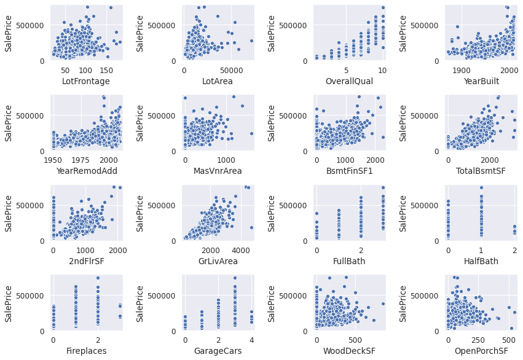
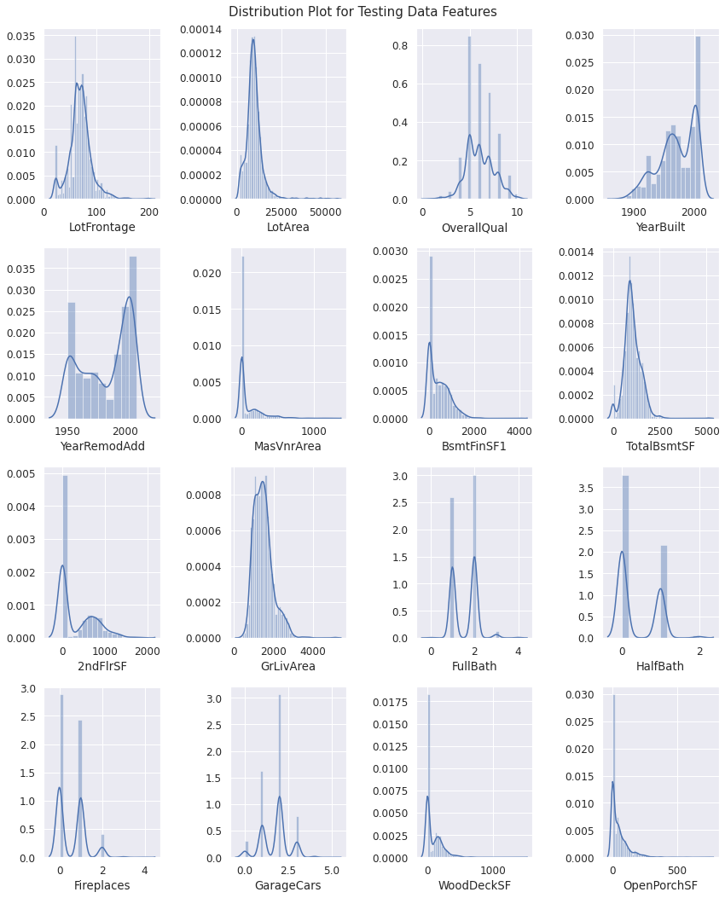
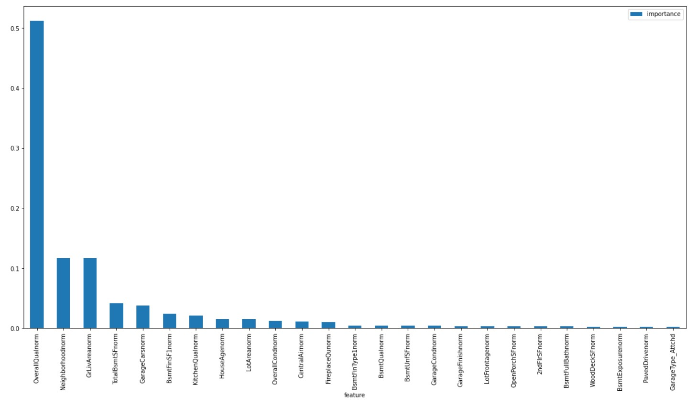

# House Pricing Prediction Portfolio
WORK IN PROGRESS

  

  

The jupyter notebook in this repo is procedural, it contains explanation of all the steps and respective findings with the use of markdowns. This readme will give a summary of the steps and results of the project.

### PROBLEM DEFINITION
Buying a home is easy! I never feel like bursting out in tears! Said no one ever.
Every one needs an enjoyable, happy place where you can live, laugh and learn. This is usually called HOME. Getting the correct evaluation for a house is very important as it is a major investment that is consequential for both the buyers and sellers.

There are various factors that influence the pricing of a house.

The goal of this portfolio is predicting prices for set of houses with reliable accuracy by examining details of features provided in a train data set.

#### Assigned Task
Ask a home buyer to describe their dream house, and they probably won't begin with the height of the basement ceiling or the proximity to an east-west railroad. But this playground competition's dataset proves that much more influences price negotiations than the number of bedrooms or a white-picket fence.

With 79 explanatory variables describing (almost) every aspect of residential homes in Ames, Iowa, this competition challenges you to predict the final price of each home.

#### Supplied Data
- train.csv - the training set
- test.csv - the test set
- data_description.txt - full description of each column, originally prepared by Dean De Cock but lightly edited to match the column names used here

#### Deliverables
- sample_submission.csv - a benchmark submission from a linear regression on year and month of sale, lot square footage, and number of bedrooms

#### Notebook Preparation
- Import Libraries
- Define Classes

### DATA DISCOVERY

#### - Obtain data
1. Load Data 
2. Examine and Get Insights on Data
   - The Train data (train_features + train_target) has 1460 rows and 81 columns, 38 numerical and 43 categorical features.
   - The Test data (test_features) has 1459 rows and 80 columns, 37 numerical and 43 categorical features. The target feature ('SalePrice) does not exist in this dataset.
3. Clean data
   - No duplicates in data as the Id feature in bothe train and test data represent a unique house information.
   - Datasets have null values
     - Training Data has 19 features with null values
     - Test Data has 33 features with null values
     
      
     
     - Upon review of each feature along with the data description provided, 4 approaches were applied to deal with the null values.
       - Columns where missing values actually mean None. Null values will be replaced with "None" in both Train & Test Data
         - PoolQC, MiscFeature, Alley, Fence, FireplaceQu, GarageType, GarageFinish, GarageQual, GarageCond, BsmtQual, BsmtCond, BsmtExposure, BsmtFinType1, BsmtFinType2, MasVnrType.
       - Numerical columns where missing values actually mean 0. Null values will be replaced with "0" in Train and Test Data respectively.
           - Train Data : GarageYrBlt, MasVnrArea
           - Test Data : BsmtFinSF1, BsmtFinSF2, BsmtUnfSF, TotalBsmtSF, BsmtFullBath, BsmtHalfBath, GarageYrBlt, GarageArea, GarageCars, MasVnrArea
       - Columns that missing data is not possible and low number of missing data. Null values to be filled with column mode in Train and Test Data respectively.
           - Train Data : Electrical
           - Test Data : Exterior1st, Exterior2nd, Functional, KitchenQual, SaleType, Utilities
       - Critical data that can be related with another column. Null values to be filled with mode value of the highly correlable column in both Train & Test Data.
           - LotFrontage
   - Data inspected for invalid data i.e. presence of outliers.
     
      

     
     
 
     
     - No SalePrice below the lower bounds in the training data
     - 61 houses with Sale Price higher than the upper bounds are valid data. In Residential Low Density Areas and LotAreas higher than the mean LotArea Size.
     - Based on scatter plots the following features have outliers, hence outliers were dropped from the features.
       - LotFrontage (> 200), Lot Area (> 100000), BsmtFinSF1 (> 4000), TotalBsmtSF (>4000), 1stFlrSF (> 4000)
4. Explore data
   - Review correlation between each numerical feature and the target variable using plots.Snapshot of produced heatmap below.
     
     

     
     

     
     - The heat map shows OverallQual, GrLivArea, FullBath, GarageCars have the highest correlation to SalePrice in that order
     - Drop the following featurs with high multicolinearity with other features.
       - GarageArea, IstFlrSF, GarageYrBlt, TotRmsAbvGrd.
     - Drop features with less than 30% correlation to the target variable (SalePrice)
       - MSSubClass,  OverallCond, BsmtFinSF2, BsmtUnfSF, LowQualFinSF, BsmtFullBath, BsmtHalfBath, BedroomAbvGr, KitchenAbvGr, EnclosedPorch, 3SsnPorch, ScreenPorch, PoolArea, MiscVal, MoSold, YrSold.
   - Review the relationship between the numerical features and the target variable (SalePrice)
     
     

     
     

     
     - Majority of the numerical features have a postive correlation to the target variable ranging from weak to strong.
   - Review correlation between all categorical features respectively by using label encoding with the mean SalePrice. Snapshot of produced heatmap below. 
     
     

     
     

     
     - The heat map shows Neighborhood, ExternalQual, BsmtQual, KitchenQual have the highest correlation to SalePrice
     - Drop Features with multicolinealirity with other features.
       - SaleCondition & Exterior2nd
     - Drop features with less than 30% correlation to the target variable (SalePrice)
     

       - Street, Alley, LandContour, Utilities, LotConfig, LandSlope, Condition1, Condition2, BldgType, RoofStyle, RoofMatl, ExterCond, BsmtCond, BsmtFinType2, Heating, CentralAir, Electrical, Functional, PavedDrive, PoolQC, Fence, MiscFeature. 
     - Review the relationship between the categorical features and the target variable (SalePrice)
     
      
     
      
     
     

     
     

     
     - Plots shows the relationship between categorical features and SalePrice. Some features have similar grading system. This will be explored for feature engineering.
 - Review skewness and distributions of the numerical features and target variable in training data.
     
      

     
     

     
     

     
     

        
     - There are 3 features identified with uni-modal, skewed distributions which could be considered for log transformation,
       - SalePrice, LotArea & GrLivArea
     - Skew of SalePrice and Log-Transformed SalePrice in training data explored.
     
     

     
     

    
5. Establish a Baseline
   - Using all the remaining features after data cleaning and exploration, create a baseline for all the algorithm planned to be used in the project. The mean absolute error is the metric utilised.
   
   

     
   

      
   Model | Score
   ------------ | -------------
   LassoRegressor | MAE: ~17837
   RandomForestRegressor | MAE: ~15713
   GradientBoostingRegressor | MAE: ~15310
   RidgeRegressor | MAE: ~ 17836
      
   - The next step is to improve the MAE values.
6. Hypothesize solutions
   - Considering the baseline model predictions are based on data provided without extensive feature generation or model tuning we will perform some feature engineering and cross validation to improve the scores before selecting the best model.

     The SalePrice prediction expected output is a continuous value hence we will use from the suite of regression supervised learning algorithms.
   - A suite of regression supervised learning algorithms are selected to improve the MAE metric with the training data.
     - Ridge and Lasso Regression - powerful techniques for creating parsmonious models in the presence of a 'large' number of features.
     - Random Forest Regressor - improves the accuracy by reducing overfitting problem and the variance in decision trees.
     - GradientBoostingRegressor - typically produces best predictions because it can optimize on different loss functions and provides several hyperparameter tuning options that make the function fit very flexible.    

### MODEL DEVELOPMENT 
1. Feature Engineering on Training data
   - Log-Tranform target variable (SalePrice) to fix skewness observed in data in section 2.4.6.1
   - Convert datatypes for the following features with integer but actually string in nature from data description. 
     - OverallQual
   - Convert some of the categorical values to numeric based on data description.
     - Neighborhood, ExterQual, BsmtQual, FireplaceQu, GarageCond, GarageQual, BsmtFinType1, HeatingQC, KitchenQual, GarageFinish, BsmtExposure
   - Create new feature "HouseAge" using the YearBuilt feature.
   - Normalize all numeric feature in preparation for modeling
   - Encode all categorical features
   - Split transformed data into train and test data for use during model creation and evaluation process.
2. Create models
   - All models are created in this section
   - Hypertuning of models were done using the GridSearch method.
3. Evaluate Models 
   - Each model was evaluated with cross validation technique using optimal parameters derived.
     

  

 

Model | Score
------------ | -------------
LassoRegressor | MAE: ~0.137592
RandomForestRegressor | MAE: ~0.100633
GradientBoostingRegressor | MAE: ~0.097434
RidgeRegressor | MAE: ~ 0.095744 
4. Test models
   - Models were tested using the split test data from the transformed merged data.

  

 

Model | Score
------------ | -------------
LassoRegressor | MAE: ~0.129181
RandomForestRegressor | MAE: ~0.089775
GradientBoostingRegressor | MAE: ~0.089001
RidgeRegressor | MAE: ~ 0.093270 

5. Select best model
   - LinearRegression (with interaction) model has the lowest MSE, hence it is selected for the salary prediction with the test dataset

### MODEL DEPLOYMENT

1. Train best model selected on the entire training data.
2. Score the Test Dataset
   - Create new feature "HouseAge" using the YearBuilt feature.
   - Convert datatypes for the following features with integer but actually string in nature from data description. 
     - OverallQual
   - Convert some of the categorical values to numeric based on data description.
     - Neighborhood, ExterQual, BsmtQual, FireplaceQu, GarageCond, GarageQual, BsmtFinType1, HeatingQC, KitchenQual, GarageFinish, BsmtExposure
   - Encode all categorical features
   - Normalize all numeric feature in preparation for modeling
   - Confirm test data matches the shape of the train dataset 
   - Deploy the model on the test data to predict SalePrice
   - Combine the test data 'Id' and the predicted SalePrice into a dataframe
   - Combine the original test data with the predicted SalePrice and export to csv as a deliverable
3. Feature Importance
   - Define function
   - Derive feature importance

  

  
